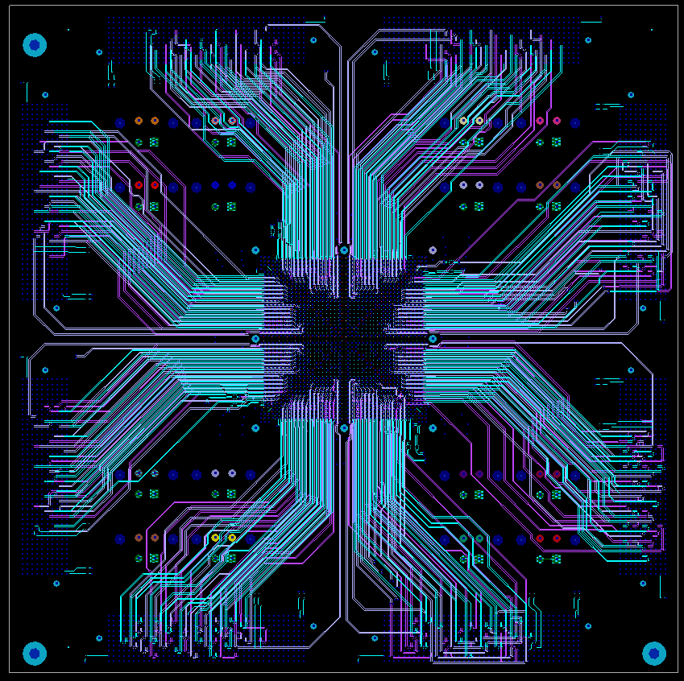

BUDDY
=================================

## Summary
* Evaluation platform for Epiphany-V
* 1024 signals accessible through FMC connectors
* 16 separate power domains
* Standard socket
* Mini-ITX form factor (170mm x 170mm)

## Documentation
[Reference Manual](docs/buddy_reference.pdf)

## Sources
* [Schematics (PDF)](src/buddy_sch_rev1.pdf)
* [Schematics (Orcad)](src/buddy_sch_rev1.dsn)
* [Layout (Allegro)](src/buddy_lay_rev1.brd)
* [BOM](src/buddy_bom_rev1.xlsx)
* [Gerbers](mfg/buddy_fab_rev1.zip)
* [Assembly](mfg/buddy_odb_rev1.zip)

## License

Licensed under Creative Commons Attribution-Share Alike 3.0 License by Andreas Olofsson  
https://creativecommons.org/licenses/by-sa/3.0/legalcode

## Status

Prototype

## Authors

[Andreas Olofsson](https://github.com/aolofsson)

