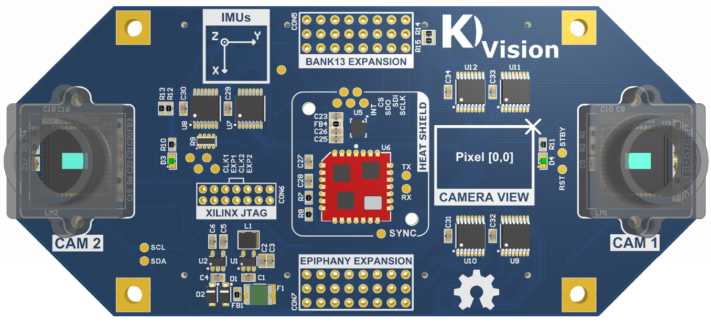

KVISION: Parallella stereo vision board
============================================

## Introduction
* A Parallella stero vision daughter card for UAV/drones imaging applications

## Key Comonents

* [MT9V034C12STM](http://www.onsemi.com/pub_link/Collateral/MT9V034-D.PDF)

## SOURCES

* [Schematic](docs/kvision_schematic.pdf)
* [Gerbers](mfg/gerbers/)
* [BOM](bom/kvision_bom.xls)

## CAD TOOL

* ALTIUM

## AUTHOR

* Emil Fresk

## LICENSE

* Creative Commons
