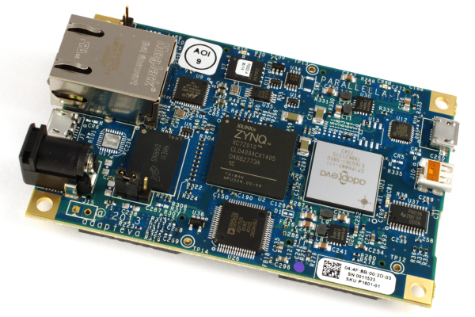
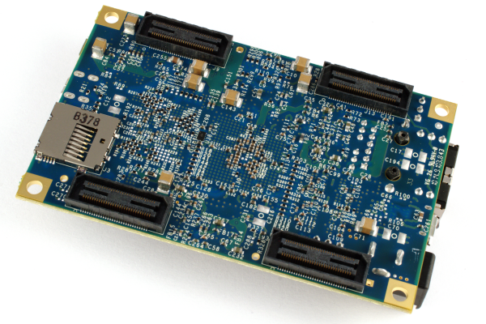

Parallella 
=================================

## Design Files

* [Reference Manual](docs/parallella_manual.pdf)
* [Schematic](docs/parallella_schematic.pdf)
* [BOM](parallella_bom.xls)
* [Gerbers](mfg)
* [Layout Source](parallella_layout.brd)
* [Schematic Source](parallella_schematic.dsn)

## CAD Tool

Cadence Allegro

## License

Licensed under Creative Commons Attribution-Share Alike 3.0 Unprotected License by by the Parallella Foundation

## Status

In production. 20,000 units built

## Authors

* [Andreas Olofsson](https://github.com/aolofsson)
* [Boston Design Solutions](http://www.bostondesignsolutions.com) (layout)

