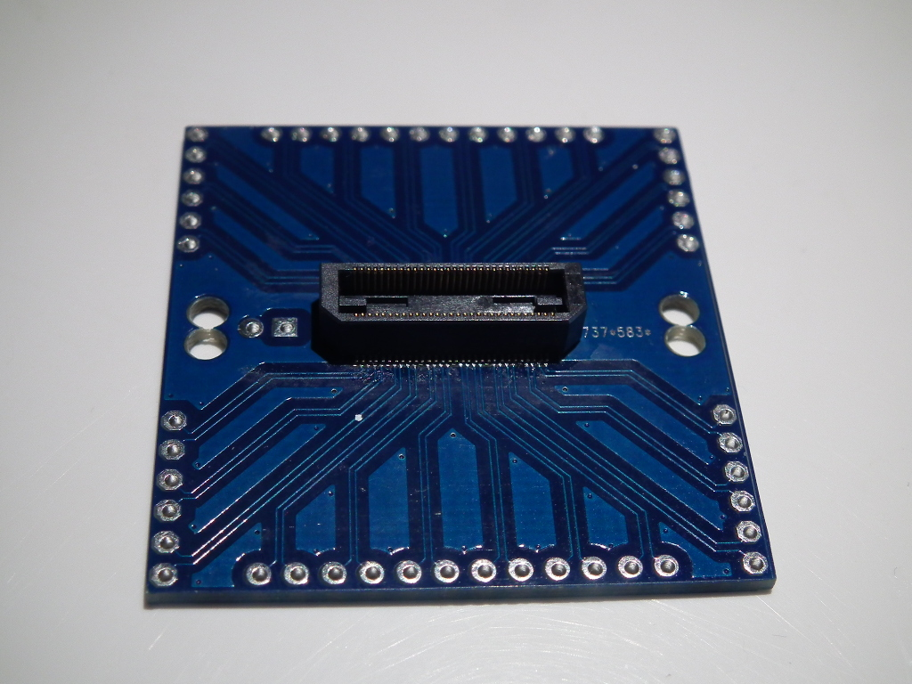

# <ParaTile>

Breakout board connecting the Samtec connector with the 100mil header pins. I am not a HW engineer so double check and use at own risk!

## Construction

Up to four boards can be tiled and fixed together with the header connectors soldered on the boarders. The 3mm mounting holes are located at same positions as on parallella.

## EDA tools

EAGLE 6.5.0 for Linux - Light Edition

## License

Published under CERN Open Hardware Licence 1.2

## Author

Tomaz Beltram
