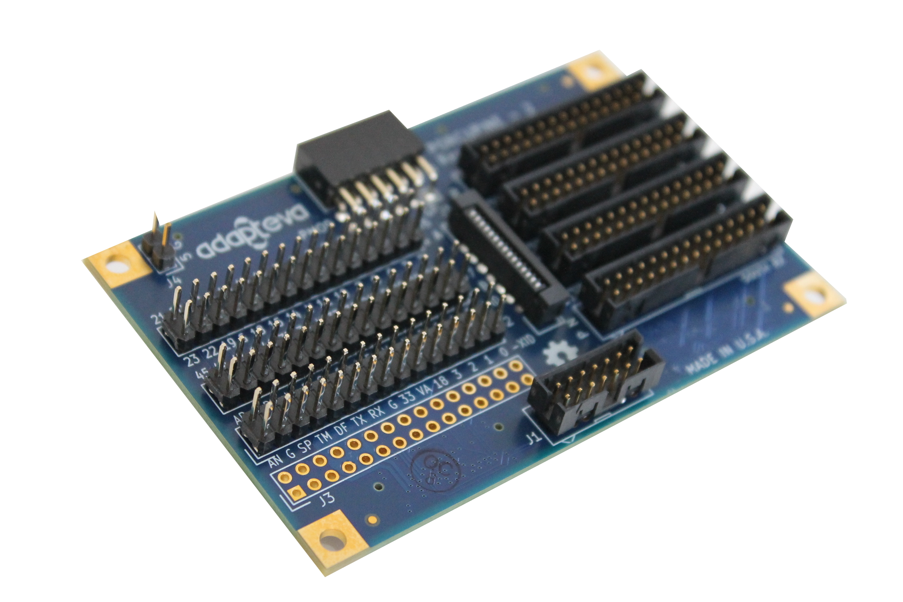

Porcupine
=================================

## Documentation
* [Reference Manual](docs/porcupine_manual.md)

## Design Files

* [Schematic](docs/porcupine_schematic.pdf)
* [BOM](porcupine_bom.xls)
* [Gerbers](mfg)
* [Layout Source](porcupine.pro)
* [Schematic Source](porcupine.sch)

## Dimensions
* 3.275" x 2.150" 

## CAD Tool

KiCad

## License

Licensed under Creative Commons Attribution-Share Alike 3.0 Unprotected License by by the Parallella Foundation

## Status

In production (>2,000 built)

## Authors

* Fred Huettig
* [Andreas Olofsson](https://github.com/aolofsson)

